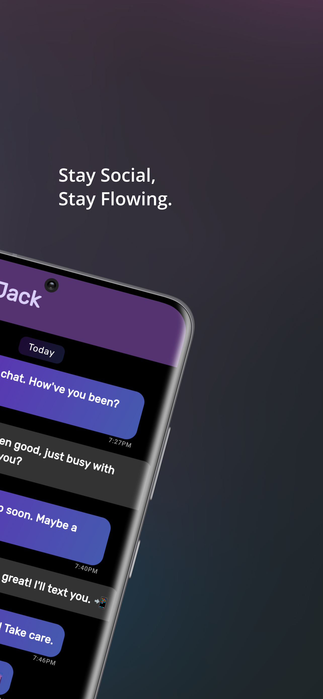

# Social Flow

This application is a Social Media application built using Flutter Frame work and Firebase as back-end, making it compatible with both Android and iOS devices, providing a seamless user experience accross different platform.

## ⚠️ Warning

Social Flow still in development, constantly being optimized and isn't still stable enough to be used in production environments.

## The Aim

The application have built to share world wide users thought and ideas accross thise platform. The app fosters social interactions like liking, commenting, sharing, and direct messaging, enabling users to connect, communicate, and build communities around shared interests.

## Technologies Used

- Flutter.
- Dart.
- Firebase.
- Firebase Auth.
- Firestore Database.
- Firebase Storage.
- Provider.

## Features

- Direct Messaging.
- Live Search Bar.
- Explore World Wide Posts.
- Interact with Others Posts.
- Beatiful User Interface.
- Edit User Information.

## Deploy

- [View On Amazon App Store](https://www.amazon.com/gp/product/B0CLKVSJYX)

## Screenshots

 
 

## Sign Up Details

- User Profile Picture *(optional)*.
- Username *(required)*.
- User Email *(required)*.
- User Password *(required)*.

## Contributing

Thank you for considering contributing to Social Flow.

## License

Social Flow is an open-source software application licensed under the [Privacy Policy Generator](https://www.freeprivacypolicy.com/live/c331680f-dc56-4218-a4b5-1bf51c915562)

